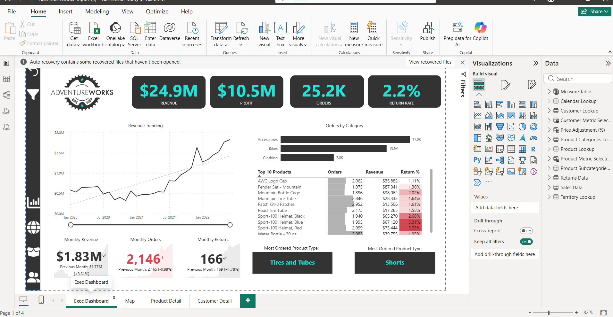
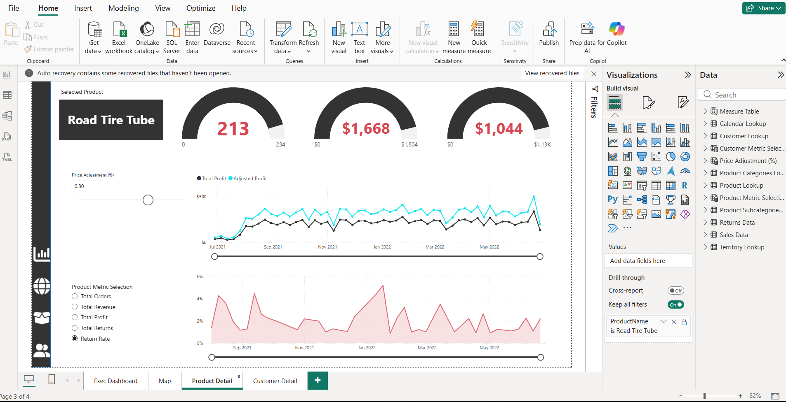

# AdventureWorks Sales Dashboard – Power BI

## Project Overview
In this project, I built an interactive Power BI dashboard to analyze sales performance, customer behavior, and product trends using the AdventureWorks dataset.

The goal was to turn raw data into a clear visual dashboard that helps track performance and support business decisions.

## Dashboard Preview

## Business Objectives
- Track revenue, profit, and orders
- Analyze product and category performance
- Understand customer behavior and value
- Monitor trends over time

## Key Dashboard Metrics
- Total Revenue: $24.9M
- Total Profit: $10.5M
- Total Orders: 25.2K
- Return Rate: 2.2%
- Unique Customers: 17.4K
- Revenue per Customer: $1,431

## Dashboard Features
### Executive Dashboard
- Revenue trends over time
- Orders by category
- Top-performing products
- Monthly KPIs for revenue, orders, and returns

### Product Analysis
- Drill-down into individual products
- Track orders, revenue, and profit against targets
- Price adjustment slider for scenario analysis
- Return-rate trends
### Product Detail Dashboard

This page allows users to analyze individual product performance, compare key metrics against targets, track trends over time, and evaluate how price adjustments may affect profitability.

### Customer Analysis
- Top customers by revenue
- Customer segmentation
- Analysis by income level and occupation

## Tools Used
- Power BI
- Power Query
- DAX
- Data modeling
- Data visualization

## Skills Demonstrated
- Data cleaning and transformation
- KPI development
- Dashboard design
- Data modeling
- Business analysis
- Interactive reporting
